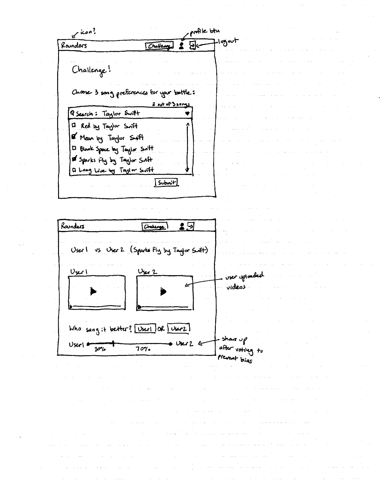

# CPSC 436I
#### Team X - Pritpal Chauhan, Manan Mehta, Ruben Gonzalez, Jie Lu, Jason Smith
#### Hosted on [rounders.io](http://rounders.io/)

## Project Description
Our project is a musical competition web app where users sign up and create profiles about themselves and their musical preferences. Users get the opportunity to accept and send out challenges to other users to face off in singing competitions with specific song choices. In each face off, other users can vote on the winner. 

Users will upload videos of themselves performing songs which we will then store, alongside match up information, rankings, and profile items (challenge history, personal info, song preferences, etc.).

Depending on time constraints we can add additional functionality for different leader boards and we can extend the platform to include playing music too. If we don't have enough time, we can reduce features on the profile page, keeping the core functionality of challenges and voting.

## Project Task Requirements
### Minimal (definitely complete)
* User authentication (log in, sign up, onboarding)
  * Create sign up and auth endpoints that return a token
  * Set up Redux to handle global auth management
  * Create UI screens using React with simple forms
* Ability to create challenges with song preferences
  * Create a challenges endpoint that takes in 3 song choices and randomly matches a user with the challenge
  * Create a form to submit a challenge request with the ability to search and choose 3 song choices
  * Create a notifications endpoint to send the matched user a notification and another endpoint to receive the chosen song
  * Create user notifications to receive a challenge and the ability to pick one of the 3 given song choices
* Ability to upload challenge videos
* Voting abilities for all users to determine winners

### Standard (most likely complete)
* Basic profile with features to view how many wins, challenge history, and choose song preferences
* Ability to view a list of challenges and accept them
* Ability to follow singers and view profiles

### Stretch
* Ability to counter challenges with additional song preferences
* Extension to other challenge formats such as playing musical instruments

## Prototypes

---

This project was bootstrapped with [Create React App](https://github.com/facebook/create-react-app).

## Available Scripts

In the project directory, you can run:

### `npm start`

Runs the app in the development mode. 
Open [http://localhost:3000](http://localhost:3000) to view it in the browser.

The page will reload if you make edits. 
You will also see any lint errors in the console.

### `npm test`

Launches the test runner in the interactive watch mode. 
See the section about [running tests](https://facebook.github.io/create-react-app/docs/running-tests) for more information.

### `npm run build`

Builds the app for production to the `build` folder. 
It correctly bundles React in production mode and optimizes the build for the best performance.

The build is minified and the filenames include the hashes. 
Your app is ready to be deployed!

See the section about [deployment](https://facebook.github.io/create-react-app/docs/deployment) for more information.

### `npm run eject`

**Note: this is a one-way operation. Once you `eject`, you can’t go back!**

If you aren’t satisfied with the build tool and configuration choices, you can `eject` at any time. This command will remove the single build dependency from your project.

Instead, it will copy all the configuration files and the transitive dependencies (webpack, Babel, ESLint, etc) right into your project so you have full control over them. All of the commands except `eject` will still work, but they will point to the copied scripts so you can tweak them. At this point you’re on your own.

You don’t have to ever use `eject`. The curated feature set is suitable for small and middle deployments, and you shouldn’t feel obligated to use this feature. However we understand that this tool wouldn’t be useful if you couldn’t customize it when you are ready for it.

## Learn More

You can learn more in the [Create React App documentation](https://facebook.github.io/create-react-app/docs/getting-started).

To learn React, check out the [React documentation](https://reactjs.org/).

### Code Splitting

This section has moved here: https://facebook.github.io/create-react-app/docs/code-splitting

### Analyzing the Bundle Size

This section has moved here: https://facebook.github.io/create-react-app/docs/analyzing-the-bundle-size

### Making a Progressive Web App

This section has moved here: https://facebook.github.io/create-react-app/docs/making-a-progressive-web-app

### Advanced Configuration

This section has moved here: https://facebook.github.io/create-react-app/docs/advanced-configuration

### Deployment

This section has moved here: https://facebook.github.io/create-react-app/docs/deployment

### `npm run build` fails to minify

This section has moved here: https://facebook.github.io/create-react-app/docs/troubleshooting#npm-run-build-fails-to-minify
